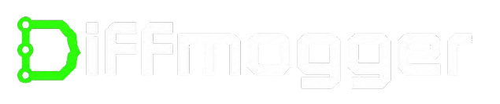
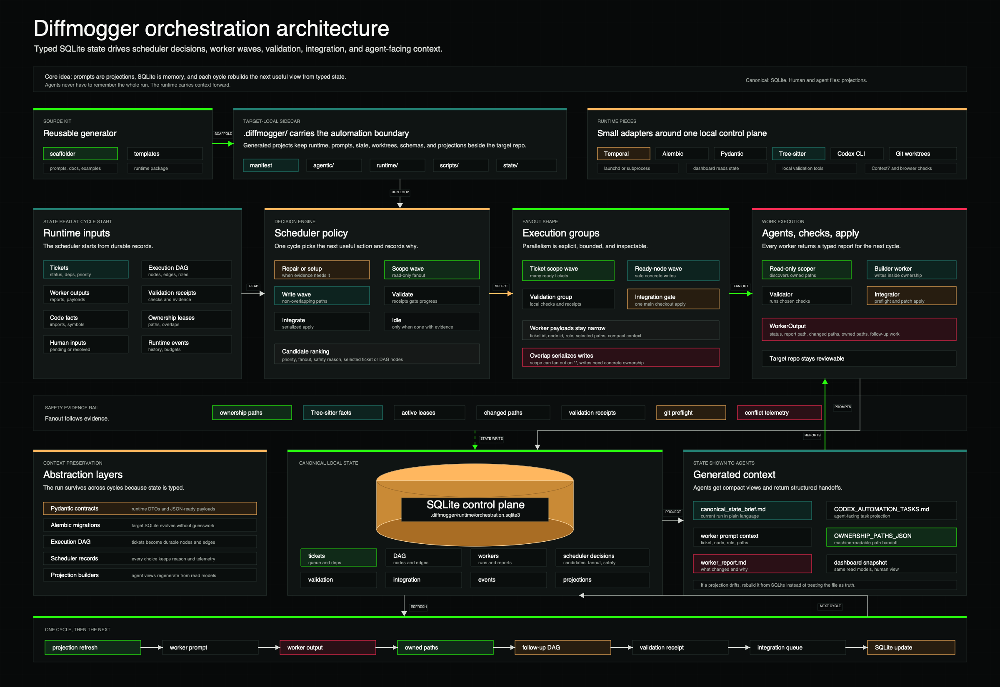

<p align="center">
  
</p>

Diffmogger is a local orchestration engine for Codex, backed by Temporal workflows and a typed SQLite read model.

It scaffolds a self-contained `.diffmogger/` sidecar into a target repo, keeps live automation state in Alembic-managed SQLite, and runs Codex work through typed graph actions such as `scope`, `build`, `review`, `validate`, `repair`, and `integrate`.

Diffmogger is not a hosted agent platform or a product-specific app. It is reusable local infrastructure for repos where Codex work needs durable state, clear handoffs, inspectable progress, safe parallelism, and reviewable outcomes across repeated runs.

<p align="center">
  
</p>

## What It Does

Diffmogger gives a target repo:

- a native dashboard for project setup, automation control, ticket/action queues, human input records, safety checks, and scheduler inspection
- a `.diffmogger/` sidecar for automation-owned prompts, runtime state, logs, queues, worktrees, schemas, manifests, and generated projections
- a canonical SQLite state store at `.diffmogger/runtime/orchestration.sqlite3`
- target-local wrappers under `.diffmogger/scripts/` and a bundled runtime under `.diffmogger/lib/diffmogger/`
- Temporal worker wrappers, launchd-backed macOS supervision, optional worker fanout, Apprise notifier integration, Context7/Playwright MCP setup, and local observatory exports

Generated Markdown and JSON files are projections. Temporal owns workflow lifecycle; SQLite is the local read-model/control-plane state.

## Quickstart

```bash
git clone https://github.com/harrisonpedrero/diffmogger.git Diffmogger
cd Diffmogger
bash scripts/validate_starter_kit.sh
bash scripts/build_native_dashboard_app.sh
open Diffmogger.app
```

In the dashboard:

1. Pick a fresh or existing target folder.
2. Fill in the project intake.
3. Add optional context files.
4. Run **Scaffold**.
5. Open **Automation** and click **Start**.
6. Use **Run Safety Check** and the target-local observatory helper when you need review artifacts.

CLI scaffold path:

```bash
python3 scripts/scaffold_project_docs.py \
  --intake examples/generic-web-app/project_intake.md \
  --target /tmp/Diffmogger-smoke \
  --force

python3 scripts/check_required_files.py /tmp/Diffmogger-smoke
```

Scaffold initializes git and creates a local `chore: initial commit` automatically when the target does not already have `HEAD`.

## Execution Model

Diffmogger materializes target automation state into a directed execution graph stored in SQLite and advances it through Temporal workflows. The goal is to continuously generate work rather than getting stuck on minor blockers. Runtime inputs include tickets, dependencies, blockers, human messages, validation receipts, worker outputs, repository capability data, Tree-sitter code facts, active leases, and execution budgets.

Those inputs become typed DAG nodes and edges. Common node types include `orchestrate`, `decompose`, `scope`, `build`, `review`, `validate`, `repair`, `integrate`, `audit`, `calibrate`, `blocker`, and `completion`.

Hard edges block only the downstream node they guard. Advisory edges carry context without stopping execution. Blockers are planning inputs that should create repair, setup, mock, fixture, defer, split, reframe, review, documentation, or alternate-ticket DAG work while tickets remain.

On each scheduler cycle, Diffmogger refreshes scoped code facts, computes runnable nodes, records scheduler candidates, conflict telemetry, execution groups, validation groups, integration queue state, and repair/unblocker work, then selects the next execution action. The scheduling policy is pure/testable outside Temporal; Temporal owns retries, timers, heartbeats, crash recovery, and long-running worker execution. If tickets remain, the scheduler should produce work.

Parallel write execution is gated by typed ownership. Diffmogger launches bounded write groups only when ownership paths, Tree-sitter symbol/import facts, confidence, validation state, and active leases support non-overlap. Missing parser support, stale facts, stale leases, low confidence, optional validation failures, and ambiguous ownership reduce fanout, create read-only scoping, or generate setup/indexing work instead of freezing unrelated automation. Integration remains serialized whenever ownership overlaps so the main checkout stays coherent.

## Generated Targets

New target repos receive a sidecar namespace:

```text
.diffmogger/agentic/      prompts, intake, role instructions, and dashboard preferences
.diffmogger/context/      imported project context files
.diffmogger/lib/          bundled Diffmogger Python runtime
.diffmogger/runtime/      SQLite state, logs, queues, worktrees, leases, reports, review artifacts
.diffmogger/scripts/      target-local command wrappers and shell helpers
.diffmogger/schemas/      exported state contracts
.diffmogger/state/        generated human and agent-facing projections
.diffmogger/manifest.json sidecar ownership and path manifest
```

The generated target repo should not need the Diffmogger source checkout at runtime. The source checkout and native dashboard are used to scaffold, operate, validate, and inspect target sidecars.

## Dashboard

The native dashboard lives in `services/agentic-dashboard/native/` and calls `scripts/dashboard_backend_cli.py`. The app has two surfaces: **Setup** for choosing/configuring a target and **Automation** for scheduler next action, tickets/actions, generated unblocker work, human input records, and Start/Stop/Safety commands. The backend exposes allowlisted JSON commands for project setup, scaffold, run control, ticket queues, canonical state snapshots, execution graph progress, worker controls, validation jobs, safety checks, execution-group debug bundles, and task projection opening.

Useful dashboard commands:

```bash
bash scripts/build_native_dashboard_app.sh
cd services/agentic-dashboard/native
npm test
npm run build
npm run tauri build
```

Backend smoke:

```bash
python3 scripts/dashboard_backend_cli.py diagnostics.environment
python3 scripts/dashboard_backend_cli.py state.snapshot --target /path/to/target
```

First review checklist: after scaffold, run **Run Safety Check** and render observatory artifacts from the target helper when needed. The helper writes `Diffmogger-observatory.html` and `Diffmogger-self-review.md`.

```bash
python3 .diffmogger/scripts/run_observatory.py --target . --review-dir /tmp/Diffmogger-review
```

## Source Layout

```text
src/diffmogger/                 Canonical Python source
src/diffmogger/kit/             Source-kit scaffold and validation tools
src/diffmogger/contracts.py     Pydantic runtime contracts and JSON-ready helpers
src/diffmogger/orchestration/   Temporal workflows, activities, worker, and scheduler policy
src/diffmogger/state/           Alembic migrations and SQLite read-model helpers
src/diffmogger/runtime/         Target runtime entrypoints and compatibility helpers
src/diffmogger/integrator/      Serialized patch integration, git safety, verification, and progress logic
src/diffmogger/observatory/     Snapshot, scoring, render, review, and local server logic
src/diffmogger/notifications.py Apprise notification adapter
src/diffmogger/supervision.py   launchd supervision with portable fallback
src/diffmogger/dashboard/       Native dashboard backend CLI and command handlers
scripts/                        Stable root command wrappers
templates/                      Files rendered into generated target repos
schemas/ and validation/starter_kit_manifest.json  Schemas and source inventory
services/agentic-dashboard/     Native dashboard docs and Tauri app
services/agentic-notifier/      Optional local/Apprise notifier service
docs/                           Active Diffmogger documentation
tests/test_new_architecture.py  Temporal/Alembic/Pydantic/Tree-sitter/Apprise smoke tests
```

## Safety Defaults

- Keep secrets out of prompts, examples, target state, inboxes, and docs.
- Use placeholders only in public examples.
- Keep notifier credentials inside `services/agentic-notifier/.env`.
- Treat notifier, MCP, ticket notifications, and browser automation as optional local features.
- Keep automation local-only unless a target explicitly opts into local runs with configured remotes.
- Review diffs before trusting autonomous changes.

Current generated targets use `ACTIVE`, `ACTIVE_WITH_PENDING_USER_INPUT`, `BLOCKED_ON_USER`, `BLOCKED_ON_ENVIRONMENT`, and `CRITICAL_STOP` as a compatibility vocabulary. These names are implementation details, not permanent product doctrine. The durable rule is that human input, missing tools, and validation failures should become typed planning inputs or follow-up work instead of silently freezing unrelated work.

Failed validation is scheduler input under the current model. Required check failures create repair work; missing tools create setup/harness work; external services create mock, local-fixture, or defer work; browser/MCP failures create alternate validation or deferred QA work; repeated failures create planner split/reframe/defer work. Future orchestration systems may express these states differently as long as the local-first safety and liveness behavior remains clear.

## Validation

Run the full local validation before publishing kit changes:

```bash
bash scripts/validate_starter_kit.sh
```

Useful focused checks:

```bash
python3 scripts/validate_starter_kit_manifest.py validation/starter_kit_manifest.json
python3 scripts/check_integration_safety.py
PYTHONPATH=src python3 -m pytest tests/test_new_architecture.py -q
```

If scaffolding behavior changes, also run the scaffold smoke:

```bash
python3 scripts/scaffold_project_docs.py --intake examples/generic-web-app/project_intake.md --target /tmp/Diffmogger-smoke --force
python3 scripts/check_required_files.py /tmp/Diffmogger-smoke
```

## Docs

Start with [docs/README.md](docs/README.md). Most-used docs:

- [Fresh Project Setup](docs/FRESH_PROJECT_SETUP.md)
- [Dashboard](docs/DASHBOARD.md)
- [Operating Model](docs/OPERATING_MODEL.md)
- [Human Bridge](docs/HUMAN_BRIDGE.md)
- [Worker Agents](docs/WORKER_AGENTS.md)
- [Troubleshooting](docs/TROUBLESHOOTING.md)

Stale architecture notes are intentionally deleted when the kit migrates. Compatibility docs should describe migration aids, not permanent rules.

## License

Diffmogger is released under the MIT License. See `LICENSE`.
